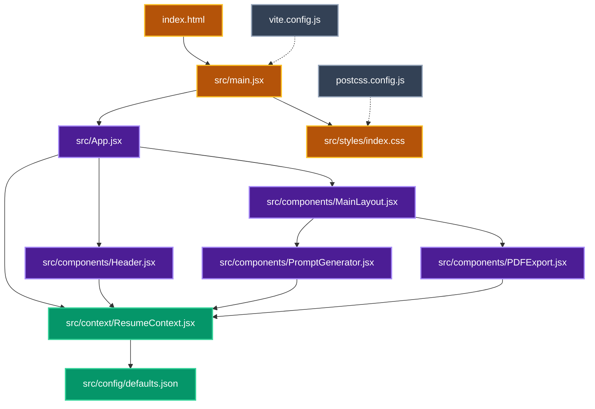

# AI Resume Architect Architecture

This document maps out the dependency graph and file structure for the AI Resume Architect application.

## Dependency Graph

The following Mermaid graph illustrates how the React components and files depend on each other. When an AI or developer needs to modify a specific part of the app, they can trace these connections to understand what else might be affected to save tokens and context limit.



## File Structure

```text
ai-resume-architect/
├── src/
│   ├── components/
│   │   ├── Header.jsx
│   │   ├── MainLayout.jsx
│   │   ├── PDFExport.jsx
│   │   └── PromptGenerator.jsx
│   ├── config/
│   │   └── defaults.json
│   ├── context/
│   │   └── ResumeContext.jsx
│   ├── styles/
│   │   └── index.css
│   ├── App.jsx
│   └── main.jsx
├── ARCHITECTURE.md
├── index.html
├── package.json
├── package-lock.json
├── postcss.config.js
├── README.md
└── vite.config.js
```

## File Descriptions

### Application Entry
* **`index.html`**: The root HTML file that mounts the React application.
* **`src/main.jsx`**: The React entry point. Renders the root `<App />` and imports the global stylesheet.
* **`src/styles/index.css`**: The main Tailwind v4 CSS file containing base styles, theme variables, custom glassmorphism card queries, and background animations.

### Core Components
* **`src/App.jsx`**: Wraps the application in the `ResumeContext` and defines the core layout (header + main content) along with the animated background orbs.
* **`src/components/Header.jsx`**: The top navigation bar. Contains the branding logomark, the Mode Switcher (Visual vs ATS), and the light/dark Theme Toggle.
* **`src/components/MainLayout.jsx`**: The two-column grid layout container holding the application's main functional sections.

### Feature Components
* **`src/components/PromptGenerator.jsx`**: The left-hand panel where the user inputs the job description. It dynamically generates robust, mode-aware AI prompts for the resume and optional cover letter/lead extraction, with 1-click copy and expand-to-modal features. Supports five toggleable prompt modifiers:
  * **Need Cover Letter?** — appends a dedicated cover letter prompt section.
  * **Target HR Lead?** — generates a Lead Intel prompt to extract recruiter name, email, company, and location from the job description.
  * **Make 95+** — injects a single ATS scoring instruction into the resume prompt. The AI acts as an ATS, scores the resume out of 100, and lists exact gaps to fix to reach 95+. Plain text output only.
  * **Reframe Older Experience** — instructs the AI to rewrite older job role titles (not the most recent) into user-specified target roles, while keeping all personal details and latest experience untouched.
  * **Weave In Unfamiliar Tools** — instructs the AI to naturally mention user-specified tools in older experience bullets where contextually plausible, without altering the most recent role.
* **`src/components/PDFExport.jsx`**: The right-hand panel where the user pastes the AI-generated markdown. It renders live previews of both documents using distinct, optimized typography for each. It features independent CSS print isolation logic for exporting the Resume, Cover Letter, or a combined PDF natively via the browser. Crucially, it manages strict PDF Title metadata by requiring a manual filename input and synchronously overriding the DOM `document.title` via `flushSync` before triggering the print dialog, ensuring ATS systems and recruiters see a professional filename in the PDF properties.

### Context & State
* **`src/context/ResumeContext.jsx`**: The global state manager (using React Context). It handles persisting data to `localStorage` (theme, mode, AI results, and resume texts) so user progress isn't lost on refresh.
* **`src/config/defaults.json`**: Contains the default baseline resume data injected into the application on first load.

### Configuration
* **`vite.config.js`**: Build settings for the Vite development server and bundler.
* **`postcss.config.js`**: Wiring for `@tailwindcss/postcss`.
